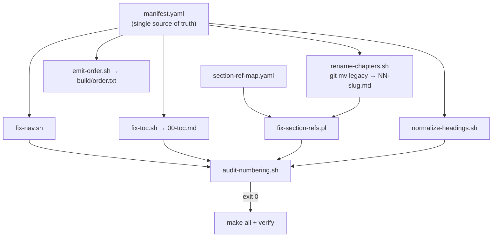

# Book Structure Normalization Plan

## Problem statement

Four numbering systems currently conflict:

| System | Issue |
|--------|--------|
| Legacy filenames (`004.md`, `062.md`, …) | 9 gaps; IDs do not match reading order |
| [000.md](000.md) TOC | 062 before parables OK; appendices out of order (068 before 065); Part Six after Final Conclusion |
| Prev/next nav | 003 skips 062; 061/062 sit after Patterns (060) instead of after parables; [061.md](061.md) has split top/footer nav |
| Internal refs | ~58 `Section 7.x` hits in [069.md](069.md); stale `Section 8.4/8.5` in [063.md](063.md); phantom `063 Section 6.x` in [060.md](060.md), [003.md](003.md); merged parable title still says "Why a Young Man Stops Caring About Others" (6 files) |

**User decision:** **Option B** — rename all files to sequential slugs in the same pass (not legacy IDs + display numbers only).

---

## Target architecture



All manuscript paths, nav links, TOC entries, and [build/order.txt](build/order.txt) are **generated from manifest** — never hand-edited again.

---

## Canonical reading order (58 numbered chapters)

Front matter (unnumbered):

| New file | Legacy | Title |
|----------|--------|-------|
| `00-title.md` | [0.md](0.md) | Title / Copyright / Preface |
| `00-toc.md` | [000.md](000.md) | Table of Contents |

Numbered chapters (`01-` … `58-` slug suffix):

| Ch | Legacy | Part | New slug (pattern) |
|----|--------|------|---------------------|
| 1 | 001 | I Foundation | `01-warriors-facing-dragons.md` |
| 2 | 002 | I | `02-crisis-resources.md` |
| 3 | 003 | I | `03-chapter-sequencing-guide.md` |
| 4 | 062 | II Parables | `04-transitions.md` |
| 5–41 | 004–043 (gaps) | II | `05-reluctant-student.md` … `41-final-bow-before-battle.md` |
| 42–47 | 046,047,049,050,054,055 | II | `42-ask-for-help.md` … `47-fire-embers.md` |
| 48 | 061 | II bridge | `48-parable-summary.md` |
| 49 | 060 | III Patterns | `49-discarded-heart.md` (§1–§6 stay inside) |
| 50 | 063 | IV Worksheets | `50-self-destruction-to-compassion.md` |
| 51 | 066 | V Workbook | `51-writing-your-life.md` |
| 52–54 | 064,065,067 | VI Tools | `52-practical-tools.md` … `54-guides-and-resources.md` |
| 55–58 | 068,069,071,070 | Appendices | `55-quick-reference.md` … **`58-final-conclusion.md` (last)** |

**Key order fixes baked into manifest:**

- `04-transitions` immediately after ch 3 (was nav-skipped)
- `48-parable-summary` after ch 47 `fire-embers`, **before** Patterns ch 49
- Back matter closes: Quick Ref → Glossary → Actualization → **Final Conclusion last**

Full slug list lives in `manifest.yaml` (one entry per file: `legacy`, `new_file`, `chapter`, `part`, `title`, `slug`, `anchors[]`).

---

## Section / worksheet numbering (content fixes)

### [49-discarded-heart.md](060.md) — keep existing scheme

```
§1  The Discarded Heart
§2  Affirmation from Others
§3  Healing the Cycle
§4  Hard Truths (4.1–4.9)
§5  Anger: Language of Fear (5.1–5.8)
§6  Additional Patterns (6.1–6.5)
```

Fix stale refs: `Section 8.4` → `Section 6.4`, `Section 8.5` → `Section 6.5` ([063.md](063.md)).

### [50-self-destruction-to-compassion.md](063.md) — adopt W1–W10 prefixes

| ID | Heading |
|----|---------|
| W1 | Abandonment and Rejection |
| W2 | Self-Worth and Identity |
| W3 | Relationships and Connection |
| W4 | Emotions and Vulnerability |
| W5 | Control and Perfectionism |
| W6 | Responsibility and Accountability |
| W7 | Forgiveness and Letting Go |
| W8 | Hope and Future |
| W9 | Integration |
| W10 | Additional Worksheets (10.1–10.4; rename inner `### 7.1` → `### 10.1`) |

Replace all prose refs like `Section 6.1` → `Worksheet W1` (or linked anchor `#w1-abandonment`).

### [56-glossary.md](069.md) — remap deleted §7.x (58 occurrences)

**Do not restore** deleted `060.md` §7. Use `section-ref-map.yaml` to remap each `Section 7.x` pointer to:

- Matching [060.md](060.md) §4–§6 subsection, **or**
- Named parable in Part II, **or**
- [064.md](064.md) tool (e.g. Cognitive Distortion One-Pager)

Drop irrecoverable `#N` emotion/bias indices; keep term definitions self-contained.

### [51-writing-your-life.md](066.md)

Rename internal `CHAPTER 1–10` / `MODULE 13–22` labels to **Module 1–10** only — never "Chapter" — to avoid collision with book chapters.

### [03-chapter-sequencing-guide.md](003.md)

- Renumber Phase parable lists **1–45** continuously (no gaps at 4–5)
- Remove file-ID coupling `(046)` from prose
- Fix cross-refs to new filenames + W1–W10 / § notation
- Replace "Why a Young Man Stops Caring About Others" → **"The Unheard Boy"** everywhere (6 hits across manuscript; skip [Parables.Shortened.md](Parables.Shortened.md) archive)

### Heading normalization rules

| File type | Target H1 |
|-----------|-----------|
| Parables (ch 5–47) | `# Chapter N — Title` (fix [006.md](006.md) which opens with bare `##`) |
| Patterns ch 49 | Keep `# N. TITLE` inside multi-section file |
| Worksheets ch 50 | `# Chapter 50 — …` + `## W1. …` sections |
| Front/back matter | `# Title` without chapter prefix where appropriate |

---

## Script suite (`scripts/book-structure/`)

| Script | Purpose |
|--------|---------|
| [manifest.yaml](scripts/book-structure/manifest.yaml) | All 60 files: legacy path, new path, chapter, part, title, slug, nav prev/next, subsection anchors |
| [section-ref-map.yaml](scripts/book-structure/section-ref-map.yaml) | Regex → replacement rules for 060/063/069/003 cross-refs |
| [audit-numbering.sh](scripts/book-structure/audit-numbering.sh) | Read-only; writes `test-results/book-structure/audit-<ts>.log.txt`; exit 1 on any failure |
| [rename-chapters.sh](scripts/book-structure/rename-chapters.sh) | `git mv` all legacy → new names; `--dry-run` flag |
| [fix-links.pl](scripts/book-structure/fix-links.pl) | Global `](legacy.md)` → `](new-file.md)` + anchor map; extend [build/rewrite-links.pl](build/rewrite-links.pl) logic |
| [fix-nav.sh](scripts/book-structure/fix-nav.sh) | Regenerate line 1 + last nav line per file from manifest |
| [fix-toc.sh](scripts/book-structure/fix-toc.sh) | Regenerate body of `00-toc.md` + sync [README.md](README.md) TOC block |
| [fix-section-refs.pl](scripts/book-structure/fix-section-refs.pl) | Apply section-ref-map across `*.md` (exclude ARCHIVE, `.cursor`, `dist`) |
| [normalize-headings.sh](scripts/book-structure/normalize-headings.sh) | H1/W-prefix/Module renames per rules above |
| [emit-order.sh](scripts/book-structure/emit-order.sh) | Write [build/order.txt](build/order.txt) from manifest |
| [verify-book-structure.sh](scripts/book-structure/verify-book-structure.sh) | `audit-numbering.sh` → `make all` → `make verify` |

**Root [Makefile](Makefile) addition:**

```makefile
structure-audit:
	./scripts/book-structure/audit-numbering.sh
structure-fix:
	./scripts/book-structure/rename-chapters.sh && \
	./scripts/book-structure/fix-links.pl && \
	./scripts/book-structure/fix-nav.sh && \
	./scripts/book-structure/fix-toc.sh && \
	./scripts/book-structure/fix-section-refs.pl && \
	./scripts/book-structure/normalize-headings.sh && \
	./scripts/book-structure/emit-order.sh
structure-verify:
	./scripts/book-structure/verify-book-structure.sh
```

**Build pipeline updates** ([build/preprocess.sh](build/preprocess.sh)):

- Read order from generated `build/order.txt` (unchanged interface)
- Update nav-strip regex for new footer format (`Chapter N — Title` labels)
- Anchor IDs derived from manifest slugs, not legacy `NNN` numbers
- Regenerate [build/rewrite-links.pl](build/rewrite-links.pl) or fold into `fix-links.pl`

---

## Audit checks (must all pass)

- Every `*.md` chapter on disk appears in manifest; no orphans
- Nav prev/next chain matches manifest end-to-end (including `00-title` → `00-toc` → ch 1)
- Zero links to deleted files: `008`, `014`, `038`, `048`
- Zero stale patterns: `Section 7\.`, `Section 8\.[45]`, `Why a Young Man Stops`, `QUESTIONS\.001`, `BASE\.001`
- Zero broken `](*.md)` links across manuscript
- Each parable file has exactly one `#` H1
- `00-toc.md` link targets match manifest order and new filenames
- `build/order.txt` matches manifest (60 lines)
- PDF sanity: preface phrase + conclusion present; TOC depth 2; epubcheck pass

---

## Execution phases (single session, atomic rename)


| Phase | Actions | Exit criteria |
|-------|---------|---------------|
| **0** | Author `manifest.yaml` + `section-ref-map.yaml` with full 60-file mapping and §7 remaps | YAML validates; reading order matches table above |
| **1** | Implement all scripts; add Makefile targets; update `.gitignore` if needed | Scripts run in `--dry-run` without error |
| **2** | Baseline audit on legacy files → save log | Inventory of all failures documented |
| **3** | **Atomic apply:** `git mv` renames → fix-links → fix-nav → fix-toc → fix-section-refs → normalize-headings → emit-order | All 60 new files exist; legacy names gone |
| **4** | `audit-numbering.sh` | Zero failures |
| **5** | `make all && make verify` | PDF + EPUB rebuilt; epubcheck 0 errors; TOC shows Ch 1–58 in order |

**Rollback:** single git revert of the rename commit if audit fails mid-apply; do not partial-rename.

---

## Files touched (estimate)

| Category | Count |
|----------|-------|
| Renamed manuscript files | 60 (`git mv`) |
| Cross-ref / content edits | ~15 files heavily ([069.md](069.md), [063.md](063.md), [060.md](060.md), [003.md](003.md), [061.md](061.md), [066.md](066.md), [README.md](README.md)) |
| New scripts + YAML | ~12 under `scripts/book-structure/` |
| Build updates | [build/preprocess.sh](build/preprocess.sh), [build/order.txt](build/order.txt), optionally [build/README.md](build/README.md) |
| Reports | `test-results/book-structure/audit-*.log.txt`, execution summary in `.cursor/plans/` |

**Not in scope:** [Parables.Shortened.md](Parables.Shortened.md) (archived), [EDITORIAL_REVIEW.md](EDITORIAL_REVIEW.md), plan/history docs.

---

## Risks and mitigations

| Risk | Mitigation |
|------|------------|
| Mass rename breaks hundreds of links | `fix-links.pl` driven by manifest; audit catches stragglers |
| 069 §7 remap is tedious | `section-ref-map.yaml` with per-term rules; scriptable batch |
| PDF anchor drift | Regenerate `build/order.txt` + rerun preprocess; verify TOC in PDF |
| External bookmarks to old filenames | Document legacy→new map in `scripts/book-structure/MIGRATION.md` |
| Git history for old paths | `git mv` preserves history; MIGRATION.md lists full map |

---

## Success criteria

1. One canonical hierarchy: manifest defines order, parts, chapter numbers, and filenames
2. All nav, TOC, and internal links resolve to new `NN-slug.md` paths
3. No stale Section 7.x / 8.x / phantom 6.x worksheet refs
4. Parable sequencing guide lists parables 1–45 without gaps
5. `audit-numbering.sh` exits 0
6. `dist/Facing-the-Dragon.pdf` and `.epub` rebuilt with correct chapter TOC (Ch 1–58, conclusion last)
