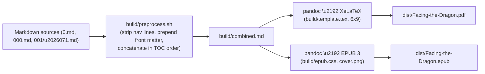

## Goal

Produce two publication-grade artifacts from the existing markdown manuscript without altering any chapter content:

- `dist/Facing-the-Dragon.pdf` — 6x9 trade-paperback PDF via Pandoc + XeLaTeX, with the 6 inline illustrations placed where they currently appear.
- `dist/Facing-the-Dragon.epub` — EPUB 3 with embedded cover and inline illustrations, Kindle/Apple Books/Kobo compatible.

No content edits. The pipeline strips inter-chapter nav lines at build time and assembles files in TOC order. All work lives under build tooling; the manuscript files stay as the source of truth.

## Source inventory (verified)

- Front matter: [0.md](0.md) (title/copyright/preface) and [000.md](000.md) (TOC).
- Body: 57 chapter files between [001.md](001.md) and [071.md](071.md) (post-merger; 008/014/038/048 intentionally absent).
- Inline images (PNG, in repo root): `RECURSIVE.box.png` ([001.md](001.md) line 5), `Stand.001.png` (001.md:191), `Stand.002.png` (001.md:323), `CUBE.men.png` ([003.md](003.md) line 5), `walking.road.png` ([README.md](README.md):4), `Dragon.Sword.png` (README.md:117).
- Every chapter file opens and closes with a markdown nav line of the form `[\u2190 Previous (NNN)](NNN.md) | [Table of Contents](000.md) | [Next (NNN) \u2192](NNN.md)` \u2014 these must be stripped before typesetting (they are screen-only navigation, not content).

## Build architecture



## Files to add (all new; no manuscript edits)

- `build/build.sh` \u2014 one-shot driver: `./build/build.sh pdf | epub | all`. Checks for `pandoc`, `xelatex`, `epubcheck`; fails fast with install hints (brew formulae). Writes to `dist/`.
- `build/preprocess.sh` \u2014 concatenation pipeline:
  1. Read manifest order from `build/order.txt` (one filename per line; default order below).
  2. For each file, strip the leading/trailing nav lines via a sed pattern matching `^\[← Previous` and lines containing `[Table of Contents](000.md)`.
  3. Demote H1 chapter titles to ensure single top-level title; rewrite intra-book links of the form `](NNN.md)` to anchor refs `](#nnn)` so cross-references stay live in PDF/EPUB.
  4. Insert a `\newpage` marker between chapters (consumed only by the LaTeX path; ignored in EPUB).
- `build/order.txt` \u2014 explicit chapter order, sourced from [000.md](000.md):
  - Front matter: `0.md`
  - Part One: `001.md, 002.md, 003.md`
  - Part Two (parables, in TOC order): `062.md, 004.md, 005.md, 006.md, 007.md, 009.md\u2026043.md, 046.md, 047.md, 049.md, 050.md, 054.md, 055.md`
  - Part Three: `060.md, 061.md`
  - Part Four: `063.md`
  - Part Five: `066.md`
  - Appendices: `068.md, 065.md, 069.md, 070.md`
  - Part Six: `064.md, 067.md, 071.md`
- `build/template.tex` \u2014 XeLaTeX template based on the `book` class, 6x9 trim, generous inner margin for spine:
  - `\\documentclass[11pt,openright]{book}` with `geometry{paperwidth=6in,paperheight=9in,inner=0.875in,outer=0.625in,top=0.75in,bottom=0.875in}`.
  - Fonts (system-installed by default on macOS): main `EB Garamond` (serif body), sans `Helvetica Neue`, mono `Menlo`. Fallback block uses `\\IfFontExistsTF` so the template still compiles on a fresh machine.
  - `microtype`, `setspace` (1.15), running headers with chapter title (left page) and book title (right page), drop-cap on first paragraph of each chapter via `lettrine`.
  - `graphicx` with `\\setkeys{Gin}{width=0.9\\linewidth,keepaspectratio}` so the 6 PNGs sit cleanly inline.
  - PDF metadata (title, author, subject, keywords) via `hyperref`, plus a clickable PDF TOC.
- `build/epub.css` \u2014 EPUB 3 stylesheet: serif body, chapter-break page rules, image `max-width:100%`, em-based sizing for reflow.
- `build/cover.png` (deferred; see Open items) \u2014 1600x2400 cover. For first build, fall back to a generated text-only cover via `build/make_cover.sh` (ImageMagick) using `Dragon.Sword.png` as the central motif until a real cover design lands in [0.md](0.md) line 32.
- `build/metadata.yaml` \u2014 Pandoc metadata block:
  ```yaml
  title: "Facing the Dragon"
  subtitle: "A Warrior's Path to Healing"
  author: "Frank Dylan del Rosario"
  rights: "Copyright \u00a9 2025 Frank Dylan del Rosario. All rights reserved."
  lang: en-US
  date: 2025
  identifier: { scheme: "ISBN", text: "TBD" }
  ```
- `.gitignore` \u2014 add `dist/` and `build/combined.md` so build artifacts stay out of git.
- `Makefile` (thin wrapper) \u2014 `make pdf`, `make epub`, `make all`, `make clean`, `make verify`.

## Build commands (final form)

PDF:

```bash
pandoc build/combined.md \
  --from=markdown+smart+raw_tex \
  --to=pdf \
  --pdf-engine=xelatex \
  --template=build/template.tex \
  --metadata-file=build/metadata.yaml \
  --toc --toc-depth=2 \
  --top-level-division=chapter \
  --resource-path=.:build \
  --output=dist/Facing-the-Dragon.pdf
```

EPUB:

```bash
pandoc build/combined.md \
  --from=markdown+smart \
  --to=epub3 \
  --metadata-file=build/metadata.yaml \
  --css=build/epub.css \
  --epub-cover-image=build/cover.png \
  --toc --toc-depth=2 \
  --split-level=1 \
  --resource-path=.:build \
  --output=dist/Facing-the-Dragon.epub
```

Verification (part of `make verify`):

- `epubcheck dist/Facing-the-Dragon.epub` \u2014 must exit 0 (Kindle/Apple Books gate).
- `pdfinfo dist/Facing-the-Dragon.pdf` \u2014 confirm page count, embedded fonts, PDF version 1.7.
- Sanity grep: PDF text extraction (`pdftotext - -`) contains the preface sentence "The dragon is waiting" and the final-conclusion marker from [070.md](070.md).
- Image inclusion check: confirm all 6 PNGs are embedded in both artifacts (`pdfimages -list` and `unzip -l` on the EPUB).

## Risks and mitigations

- **TeX install size** \u2014 mitigated by recommending `brew install --cask mactex-no-gui` or `basictex` + on-demand `tlmgr install` of `lettrine, microtype, fontspec, geometry, hyperref, xcolor`. `build/build.sh` prints the exact `tlmgr` line if a package is missing.
- **Font availability** \u2014 template uses `\\IfFontExistsTF` to gracefully fall back to TeX Gyre fonts so the build is reproducible on a CI box without EB Garamond.
- **Intra-book link rewriting** \u2014 covered by the `preprocess.sh` regex that converts `](NNN.md)` to anchor links generated from each chapter\u2019s H1 (Pandoc auto-IDs).
- **Nav line stripping** \u2014 conservative sed; only matches lines beginning with `[\u2190` or ending with `\u2192)` plus the literal `[Table of Contents]` line. Falsely-matching content lines: none found in a manuscript-wide grep.
- **Cover** \u2014 a real cover does not exist yet ([0.md](0.md) line 32 says TBD). First build ships with a generated placeholder cover; final cover swap is a one-line file replacement.

## Open items for user decision (non-blocking, can default)

- **Final cover artwork** \u2014 placeholder for now; final design needed before public release.
- **ISBN-13 / ISBN-10 / LCCN** \u2014 currently TBD in [0.md](0.md); EPUB metadata will carry `TBD` until assigned. Recommend assigning before the first published build.
- **Trim size confirmation** \u2014 plan defaults to 6x9 (industry standard for trade paperback non-fiction). 5.5x8.5 or 5.25x8 are common alternatives if a more compact form factor is preferred.
- **Drop caps on/off** \u2014 plan defaults to on for chapter openers; trivially disabled.