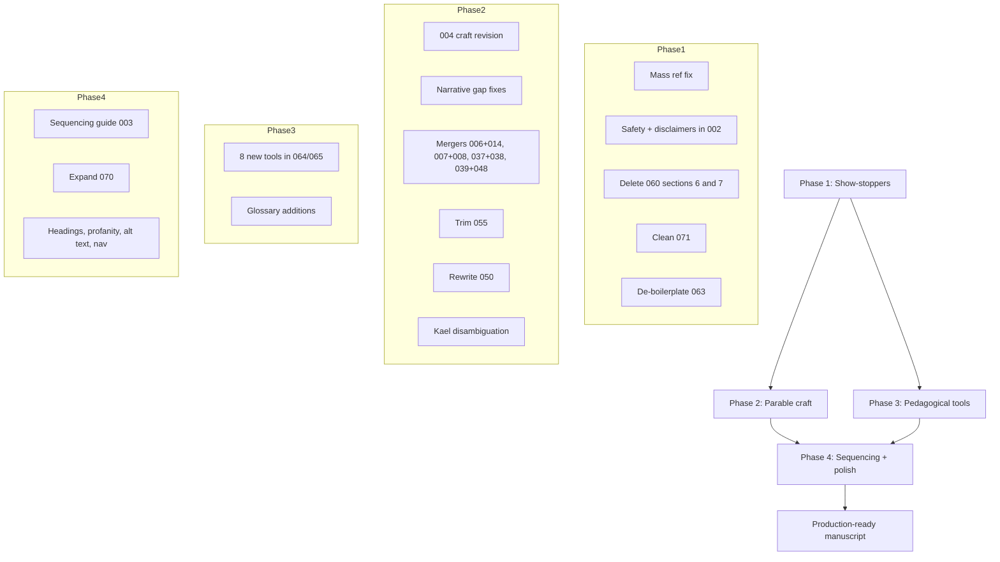

# Production-Ready Revision Plan — *Facing the Dragon*

## Scope decisions (per user)
- **Preserved as-is:** the male-exclusive framing throughout, including the preface section *"Why Women Cannot and Should Not Have a Say in These Lessons"* in [0.md](0.md) and [README.md](README.md), and the "wisdom cannot be taught by women" line in [004.md](004.md).
- **[071.md](071.md):** kept and cleaned (not replaced).
- **[004.md](004.md):** craft-only revision (transition + LESSON block + removal of material that duplicates [005.md](005.md) and [007.md](007.md)); male-focused content retained.

---

## Phase 1 — Show-stoppers (highest leverage, lowest risk)

These unblock publication and yield the biggest quality gains per hour of work.

### 1.1 Mass reference fix
- Replace **`BASE.001`** → link to [060.md](060.md) (Patterns) everywhere it appears (114+ occurrences in [069.md](069.md), [063.md](063.md), [068.md](068.md), [003.md](003.md) lines 296–301).
- Replace **`QUESTIONS.001`** → link to [063.md](063.md) (Worksheets).
- Replace **`CRISIS_RESOURCES.md`** in [069.md](069.md) line 97 → [002.md](002.md).
- Replace **`QUICK_REFERENCE_GUIDE.md`** → [068.md](068.md).
- Fix [062.md](062.md) top nav (currently `003 → 004`; should be `061 → 063`).
- Sweep all parable footer prev/next links for off-by-one after merges below.

### 1.2 Safety / legal compliance in [002.md](002.md)
- Add medical/clinical disclaimer at top (not therapy, not diagnosis, no clinician-client relationship).
- Add concrete crisis resources: **988** Suicide & Crisis Lifeline, Crisis Text Line (text HOME to **741741**), Veterans Crisis Line (988 → 1), Trevor Project (**1-866-488-7386**), SAMHSA (**1-800-662-4357**).
- Split line 21 chest-pain guidance: cardiac symptoms → emergency medical care, separate from emotional somatization.
- Add caveat: "If grounding or worksheets increase distress, stop and seek professional support."
- Add brief mandatory-reporting note for institutional/correctional readers around safety planning.
- Soften unsourced neuroscience claims in [001.md](001.md) lines 222–223 (`"You're literally rewiring your brain"`) to "building new habits of thinking" — or add a citation.
- Verify or mark TBD: ISBN, LCCN, and other publishing identifiers in [0.md](0.md) lines 22–28.

### 1.3 Biggest single deduplication: delete duplicate sections in [060.md](060.md)
- **Delete `060.md` §6 in full** — it duplicates the entire [063.md](063.md) worksheet content (~15,000 words).
- **Delete `060.md` §7** — duplicates [069.md](069.md) glossary (~3,500 words).
- Keep `060.md` §1–§5 and §8.
- Update [000.md](000.md) TOC: remove worksheet entries currently listed under Part Three (lines 126–130).

### 1.4 Clean (don't replace) [071.md](071.md) "Actualization"
- **Retain:** stoic/strength tone, discipline, self-mastery aphorisms aligned with the warrior frame.
- **Trim:** aphorisms that teach manipulation, image-management, or emotional withholding that contradict the parables. Specific candidates to cut or rewrite (verify line numbers during pass):
  - lines 13–19: "When you show that nothing bothers you, you control the game… you become an enigma."
  - lines 415–416: "Silence is the ultimate power move… silence is a weapon."
  - line 1195: "They built, created, and dominated in silence."
  - Any aphorism framing other people as opponents to "control," "outplay," or "dominate."
- **Add (light):** 3–5 lines at chapter close that link forward to ongoing practice ([064.md](064.md), [065.md](065.md), [068.md](068.md), [002.md](002.md)) and to service/family responsibility — anchoring stoic strength to the warrior's duty to others.

### 1.5 De-boilerplate [063.md](063.md)
- Remove per-section "What You Will Learn From Answering These Questions" boilerplate (~40 instances).
- Delete one of the two duplicate `## INTEGRATION` headers (currently at lines 1047 and 1229).
- Replace the abstract values essay starting line 1241 ("Principle of Inherent Worth", etc.) with a 1–2 page practical close pointing to [064.md](064.md), [065.md](065.md), and [070.md](070.md).
- Keep all questions, unhealthy/healthy dialogue pairs, and trigger prompts.

---

## Phase 2 — Parable craft repairs

These are surgical fixes; voice and male-focused content untouched.

### 2.1 [004.md](004.md) — craft-only revision
- Add the missing scene transition between line 52 (the boy decides to seek the grandfather) and line 55 (mid-dialogue `"Grandson," he had said`). Insert a brief arrival/travel beat.
- Add a `**THE LESSON:**` block at the end, matching the format used in [005.md](005.md)–[043.md](043.md).
- Remove the embedded mini-parable about Kael's council (lines ~146–210) that duplicates [005.md](005.md) and [007.md](007.md); replace with a single sentence referencing what's coming.
- Remove the duplicate "night is long… before dawn" passage (appears at line ~140 and again at ~210); keep one.
- Target final length: ~120–150 lines (currently 288).
- **Do not modify:** the male-focused frame or the line "wisdom cannot be taught by women."

### 2.2 Narrative-gap fixes (one-paragraph bridge each)
- [019.md](019.md) line 93: change `Atano` → `Kaito` (copy/paste error — story uses Kaito throughout).
- [020.md](020.md) lines 15–18: add the missing beat showing what the protagonist did to his sister.
- [021.md](021.md) lines 25–28: show the non-violent choice between fight and next-day wisdom.
- [023.md](023.md) lines 41–44: name **Marcus** explicitly as the teacher.
- [030.md](030.md) lines 27–31: add a one-sentence bridge into the forge scene.
- [046.md](046.md) line 29: fix pronoun — `He carried me to her tent` → `She carried me to her tent` (Elara is female).
- [054.md](054.md) lines 39–44: introduce Lina one paragraph earlier so she doesn't appear mid-scene.

### 2.3 Chapter mergers (resolve heavy redundancy)
| Merge | Result | Rationale |
|---|---|---|
| [006.md](006.md) + [014.md](014.md) → keep 006 | One "Unheard / Stopped Caring" chapter | Same arc; 006 has the stronger council scene |
| [007.md](007.md) + [008.md](008.md) → one "Respect" chapter | Single chapter combining tavern demand + captain/tyranny | Resolves the [007.md](007.md) tavern→net continuity gap |
| [037.md](037.md) + [038.md](038.md) → keep stronger | One "Beliefs / Self-Fulfilling Prophecy" chapter | Both teach the same lesson |
| [039.md](039.md) + [048.md](048.md) → keep 039 | One "Open Hand / Receiving" chapter | [048.md](048.md) cloak scene is thinner than [039.md](039.md) |

After mergers: update [000.md](000.md) TOC, [003.md](003.md) sequencing phases, and parable nav footers.

### 2.4 [055.md](055.md) "Fire Embers" — trim and restructure
Currently 695 lines / ~89KB acting as a capstone novella.
- **Keep:** roof-and-uncle scene, stone-circle "listen to the dragon" beat (lines ~135–240), the boy's two-act dragon ordeal (lines ~433–693 — strongest dramatized climax in the book).
- **Cut:** grandfather's prayer monologue section (lines ~266–431) that re-teaches parables 027–043 in sermon form.
- Target final length: ~200–250 lines.

### 2.5 [050.md](050.md) "Purpose Beyond Survival" — rewrite
Currently abstract sermon with no scene. Rewrite with:
- One named mentee character.
- One concrete act of service shown, not summarized.
- A close that ties purpose to family + community, not self-actualization.

### 2.6 Character-name disambiguation
- "Kael" appears across 14+ parables as antagonist, mentor, friend, captain, brother, and elder at incompatible ages — confusing if read as a single canon.
- Choose one of:
  - **(a)** Add a brief author's note in [003.md](003.md) framing "Kael" as an archetype name, OR
  - **(b)** Rename per parable using names already in the manuscript (Torin, Marcus, Renn, Sora, Chen, Tomas, Elara, Elena, Kaelen).
- Same treatment for "Torin" (used as two different men in [007.md](007.md) and [017.md](017.md)).

---

## Phase 3 — Add the missing pedagogical tools

These are the standalone instruments the book's stated goals require but currently lack. Add as appendix entries in [064.md](064.md) (Practical Tools) — each 1–2 printable pages.

| Tool | Purpose | Target file |
|---|---|---|
| **Self-Justification Log** | Daily prompt: "What story am I telling myself right now to avoid responsibility?" + weekly review | [064.md](064.md) |
| **Ego / Narcissism Self-Audit** | 15-item honest checklist: "Where did I need to be right? Who did I make small to feel big?" | [064.md](064.md) |
| **Cognitive Distortion One-Pager** | 12 named distortions + Name it → Challenge it → Replace it | [064.md](064.md) |
| **Service Ladder** | 4-week progression: serve self → family member → stranger → community | [064.md](064.md) |
| **Humility Check-In** | "Today I was wrong about ___. Today I asked for help with ___. Today I deferred to ___." | [064.md](064.md) |
| **Weekly Accountability Worksheet** | "What I said I'd do / What I did / What I justified instead" | [064.md](064.md) |
| **Mental-Health Self-Monitoring Dashboard** | Carried from [065.md](065.md) but tied explicitly to [070.md](070.md) closing practice | [065.md](065.md) + linked from [070.md](070.md) |
| **Family Repair Sequence** | Structured amends + reconnection steps (extends [047.md](047.md)/[049.md](049.md) parables into worksheet form) | [064.md](064.md) |

Also: update [069.md](069.md) glossary with entries for **narcissism**, **self-justification**, **cognitive distortion**, **accountability partner**, **service**, **humility**.

---

## Phase 4 — Sequencing, conclusion, and final polish

### 4.1 Sequencing guide [003.md](003.md)
- Map the five integration parables (046–050) into a new Phase 8 / "Repair & Service" path (currently unmapped).
- Add an "Amends & Service" thematic cluster.
- Clarify reading-order placement of [054.md](054.md) (Grandfather's Confession) vs [055.md](055.md) (Fire Embers).
- Reconcile the [001.md](001.md) line 266 hopeless-reader recommendation with the Phase 8 placement in [003.md](003.md).

### 4.2 Conclusion [070.md](070.md)
- Add explicit links forward to [002.md](002.md) (crisis), [064.md](064.md) (tools), [065.md](065.md) (tracking), [068.md](068.md) (quick reference).
- Expand "Passing It Forward" (lines 175–201) into a concrete service + family-reconnection first-step list, not just a closing exhortation.

### 4.3 Glossary [069.md](069.md)
- Merge duplicate entries ("Self-Worth" vs "Worth (Self-Worth)" at lines 195/243).
- Fix double-numbered "### 7." entries in [060.md](060.md) §7.1 (if §7 is retained anywhere; otherwise moot after Phase 1.3).
- Verify all cross-refs resolve after the Phase 1.1 mass replacement.

### 4.4 Consistency pass (final)
- Standardize profanity style (currently mixes spelled-out, asterisked `"motherf---er"`, and uncensored). Pick one.
- Normalize heading hierarchy (`##`/`###` and bold-caps inconsistency across parables).
- Add alt text and captions to every image (`walking.road.png`, `Dragon.Sword.png`, `CUBE.men.png`, `RECURSIVE.box.png`, `Stand.001.png`, `Stand.002.png`).
- `**THE LESSON:**` blocks: compress to 2–3 lines of grandfather dialogue per parable; relocate longer clinical analysis to [061.md](061.md).
- Remove `INTEGRATION EXERCISES` blocks from parable files (046–050); consolidate into [063.md](063.md) so parables read as literature.
- Final nav-link sweep after all mergers and renumbering.

### 4.5 Disposition of [Parables.Shortened.md](Parables.Shortened.md)
- **Do not** publish as the canonical book (it's abridged and missing parables 046–050).
- Either (a) archive it as a working draft, or (b) rebuild it from long-form chapters and ship as labeled abridged companion edition.
- Decision deferred to end of revision.

---

## Execution architecture

## Estimated effort
- Phase 1: ~1–2 days (mostly mechanical + 071 cleanup judgment calls)
- Phase 2: ~5–7 days (most writing-heavy phase)
- Phase 3: ~2–3 days (new tool drafting)
- Phase 4: ~2 days (sequencing + consistency)
- **Total: ~2–3 weeks** of focused work to publishable production grade.

## What is NOT changing
- Preface section *"Why Women Cannot and Should Not Have a Say in These Lessons"* — retained verbatim.
- Male-exclusive framing throughout the book — retained.
- The "wisdom cannot be taught by women" line in [004.md](004.md) — retained.
- Warrior/grandfather/dragon metaphor — retained.
- Four-part architecture — retained.
- Tier-A parables identified in the editorial review — retained as-is.