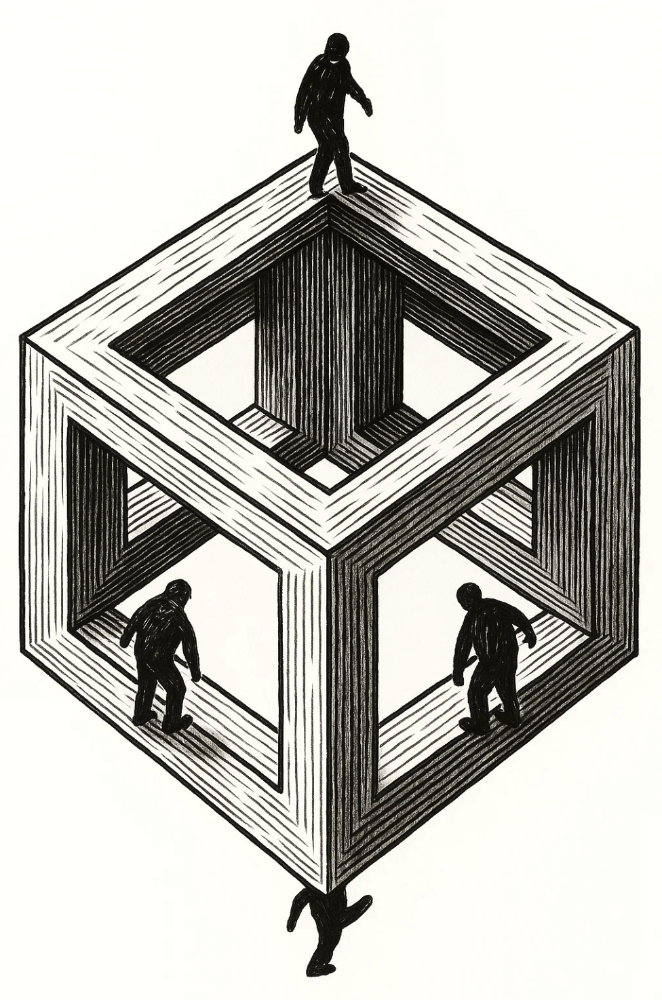

[← Previous: Chapter 2 — Crisis Resources and Safety Protocols](02-crisis-resources.md) | [Table of Contents](00-toc.md) | [Next: Chapter 4 — Transitions →](04-transitions.md)

# CHAPTER SEQUENCING GUIDE

## **How to Navigate the Parables**

The parables in this book can be read in any order, but some paths through them will be more helpful than others depending on where you are in your healing journey. This guide offers several recommended paths, thematic groupings, and guidance on which parables to read when.

---

## **A Note on Names**

You will notice that certain names recur across the parables. **Kael** appears in many stories, sometimes as a mocking peer, sometimes as a captain, sometimes as a mentor, sometimes as a blacksmith, sometimes as a friend who refuses to leave. **Torin** appears as two distinct men in different parables. These are not always meant to be the same person across the manuscript.

Treat these names as **archetypes**. *Kael* is the figure who exposes you to yourself, the one in front of whom your dragon shows itself most plainly, whether as opponent, teacher, friend, or rival. *Torin* is the figure who tells you a hard truth you did not ask for. Within any single parable, the name refers to one specific person in that story. Across the manuscript, the names refer to a role that any number of men have played in the grandfather's life and may yet play in yours.

If a name puzzles you between parables, read each parable on its own terms first. The lesson, not the bloodline of the supporting cast, is what matters.

---

## **RECOMMENDED READING ORDER (First Time Through)**

If you're reading the parables for the first time, this sequence will build understanding progressively:

### **Phase 1: Foundation (Start Here)**

These parables establish the core concepts and introduce you to the grandfather and the boy:

1. **The Reluctant Student** - The beginning. The boy comes to his grandfather seeking help.
2. **The Grandfather Speaks of Worth** - Understanding self-worth and how it's formed.
3. **The Unheard Boy** - How emotional dismissal creates shutdown.
4. **Respect: The Gateway to the Dragon** - How respect becomes a desperate need, and how that need becomes tyranny when it is dressed in command.

**Why this order:** These establish the foundation—who the characters are, what the core wounds are, and why the work matters.

### **Phase 2: Understanding the Dragon**

Now that you understand the foundation, these parables help you understand what the "dragon" really is:

1. **The Real Nature of the Dragon** - What the dragon actually represents.
2. **The Dragon of Wounded Pride** - How pride masks deeper wounds.
3. **What It Means to Face the Dragon** - The true meaning of facing your wounds.
4. **The Fire Inside** - Understanding anger as a messenger.
5. **The Fire Embers** - The grandfather's full story of facing his dragon.

**Why this order:** These deepen your understanding of what you're actually facing—not a monster, but unhealed wounds.

### **Phase 3: The Wounds and Patterns**

These parables explore specific wounds and how they manifest:

1. **The Unseen Wound** - Wounds we pretend don't exist. (See also: the second movement of *The Unheard Boy*, where the warrior's emotional shutdown, the "stopped caring" arc, is folded into the same chapter.)
2. **The Wounded Bear** - Reactive aggression from unacknowledged pain.
3. **The Chained Giant** - Learned helplessness and breaking free.
4. **The Shattered Helmet** - Mental defenses and their importance.

**Why this order:** These show you the specific wounds and patterns you may recognize in yourself.

### **Phase 4: Emotional Mastery**

These parables teach about emotions and how to work with them:

1. **The Warrior Who Could Not Cry** - Suppressed emotions and their cost.
2. **The Lion Who Feared His Roar** - Fearing your own power and intensity.
3. **The Two Wolves by the River** - The choice between reactive rage and reflective wisdom.
4. **The Three Rivers** - Integrating thought, feeling, and action.
5. **The Empty Quiver** - Discipline in emotional responses.

**Why this order:** These help you understand and work with your emotional life.

### **Phase 5: Identity and Masks**

These parables explore the masks we wear and who we really are:

1. **The Unfinished Mask** - The masks we create to hide our true selves.
2. **The Seven Doors** - Different ways of defending ourselves.
3. **The Test of the Six Mirrors** - Facing different aspects of yourself.
4. **The Warrior Who Walked Backward** - Living in defense of old wounds.
5. **The Warrior Who Chased Every Shadow** - Fighting phantoms instead of real threats.

**Why this order:** These help you see the defenses you've built and begin to question them.

### **Phase 6: Character and Strength**

These parables teach about true strength and character:

1. **The Anvil and the Sword** - How character is forged.
2. **The Blacksmith's Tongs** - The balance between control and release.
3. **The Silent Stone** - Rigidity vs. flexibility.
4. **The Thornling Tree** - Defensive hardness and the possibility of softening.
5. **The Haunted Blade** - How your tools carry the imprint of how you've used them.

**Why this order:** These redefine strength and show you what real character looks like.

### **Phase 7: Wisdom and Integration**

These parables teach about wisdom, patterns, and integration:

1. **The Masterless Horse** - Power without direction becomes destruction.
2. **The Broken Drum** - The importance of emotional rhythm and consistency.
3. **The Lamp with No Oil** - Giving from depletion vs. abundance.
4. **The Echoing Cave** - How your expectations create your reality, and how the inherited beliefs that drive those expectations can be examined and rewoven.

**Why this order:** These help you understand deeper patterns and how to integrate wisdom.

### **Phase 8: The Journey Forward**

These parables point toward healing and the path forward:

1. **The Open Hand** - Opening instead of closing, receiving instead of demanding (and learning that the open hand does not refuse a gift either).
2. **The Waterfall** - Letting go and flowing with life.
3. **The Spear with Two Points** - The danger of weapons that harm both ways.
4. **The Hunter Who Never Missed** - Precision and choosing your targets wisely.
5. **The Final Bow Before Battle** - Bowing to your truth before facing challenges.

**Why this order:** These provide hope, direction, and a vision of what's possible.

### **Phase 9: Repair & Service (the second half of the path)**

These parables, the integration cluster, assume the inward work is in progress. They turn the warrior outward, toward the people he has hurt or failed and the people who now need him. Read these *after* you have done at least some honest work with Phases 1–8.

1. **The Warrior Who Learned to Ask for Help** - Pride collapses; the warrior receives help for the first time.
2. **The Man Who Forgave His Father** - Inherited wounds, named and released.
3. **The Man Who Broke the Cycle with His Children** - The cycle ends inside one household.
4. **The Warrior Who Found Purpose Beyond Survival** - Healing as the road clearing; service as what the road was for.
5. **The Grandfather's Confession** - The grandfather tells the truth of his own past directly to his grandson; the final teaching given as plain admission rather than parable.
6. **The Fire Embers** - The capstone ordeal. Read last. Best read after the reader has at least once gone through Phases 1–9 above; functions as the dramatic re-enactment of the whole arc in a single night.

**Why this order:** Healing is the road clearing; service is what the road is for. *The Grandfather's Confession* precedes *The Fire Embers* because the confession sets up the grandfather's authority to speak the capstone, and because the boy's interior journey in 055 is the answer to what the grandfather has just confessed.

---

## **THEMATIC GROUPINGS**

### **When You're Dealing with Anger**

Read these parables together:
- The Fire Inside
- The Wounded Bear
- The Lion Who Feared His Roar
- The Two Wolves by the River
- The Empty Quiver
- The Spear with Two Points

### **When You're Struggling with Self-Worth**

Read these parables together:
- The Grandfather Speaks of Worth
- The Unheard Boy
- Respect: The Gateway to the Dragon
- The Unfinished Mask
- The Test of the Six Mirrors

### **When You're Feeling Stuck or Helpless**

Read these parables together:
- The Chained Giant
- The Warrior Who Walked Backward
- The Silent Stone
- The Masterless Horse
- The Waterfall

### **When You're Struggling with Relationships**

Read these parables together:
- The Unheard Boy
- The Unheard Boy
- The Open Hand
- The Broken Drum
- The Lamp with No Oil

### **When You're Ready to Face Your Wounds**

Read these parables together:
- The Real Nature of the Dragon
- What It Means to Face the Dragon
- The Unseen Wound
- The Test of the Six Mirrors
- The Final Bow Before Battle
- The Fire Embers

### **When You're Working on Emotional Expression**

Read these parables together:
- The Warrior Who Could Not Cry
- The Fire Inside
- The Three Rivers
- The Broken Drum
- The Lion Who Feared His Roar

### **When You're Learning About Control and Letting Go**

Read these parables together:
- The Blacksmith's Tongs
- The Silent Stone
- The Masterless Horse
- The Waterfall
- The Open Hand

---

## **DIFFICULTY LEVEL INDICATORS**

### **Beginner-Friendly (Start Here)**

These parables are accessible and foundational:
- The Reluctant Student
- The Grandfather Speaks of Worth
- The Unheard Boy
- Respect: The Gateway to the Dragon
- The Real Nature of the Dragon

### **Intermediate (After You've Read the Basics)**

These require some understanding of the concepts:
- The Fire Inside
- The Wounded Bear
- The Two Wolves by the River
- The Three Rivers
- The Seven Doors
- The Open Hand

### **Advanced (When You're Ready to Go Deeper)**

These explore complex concepts and may be emotionally challenging:
- What It Means to Face the Dragon
- The Fire Embers
- The Test of the Six Mirrors
- The Final Bow Before Battle
- The Grandfather's Confession

---

## **PREREQUISITES**

**Before reading "What It Means to Face the Dragon":**
- Read at least: The Reluctant Student, The Real Nature of the Dragon, The Fire Inside

**Before reading "The Fire Embers":**
- Read: What It Means to Face the Dragon, The Fire Inside, and several other parables to understand the full context

**Before reading "The Final Bow Before Battle":**
- Read: The Test of the Six Mirrors, What It Means to Face the Dragon

**Before reading "The Grandfather's Confession":**
- Read: Most of the other parables first, as this is the culmination

---

## **ALTERNATIVE PATHS**

### **Path 1: The Quick Overview**

If you want to understand the core concepts quickly, read:
1. The Reluctant Student
2. The Grandfather Speaks of Worth
3. The Real Nature of the Dragon
4. What It Means to Face the Dragon
5. The Fire Embers

This gives you the essential story and concepts in 5 parables.

### **Path 2: The Emotional Focus**

If you're primarily struggling with emotions, read:
1. The Fire Inside
2. The Warrior Who Could Not Cry
3. The Lion Who Feared His Roar
4. The Two Wolves by the River
5. The Three Rivers
6. The Empty Quiver

### **Path 3: The Relationship Focus**

If you're primarily struggling with relationships, read:
1. The Unheard Boy
2. The Unheard Boy
3. Respect: The Gateway to the Dragon
4. The Broken Drum
5. The Lamp with No Oil
6. The Open Hand

### **Path 4: The Identity Focus**

If you're struggling with who you are and who you want to be, read:
1. The Grandfather Speaks of Worth
2. The Unfinished Mask
3. The Seven Doors
4. The Test of the Six Mirrors
5. The Threads of Fate
6. The Final Bow Before Battle

---

## **HOW TO USE THIS GUIDE**

7. **First time reading:** Follow the Recommended Reading Order (Phase 1-8)
8. **Returning to specific themes:** Use the Thematic Groupings
9. **Feeling overwhelmed:** Stick to Beginner-Friendly parables
10. **Ready to go deeper:** Move to Intermediate and Advanced
11. **Short on time:** Use one of the Alternative Paths

**Remember:** There's no wrong way to read these parables. This guide is a suggestion, not a requirement. Trust your intuition about what you need to read and when.

**Also remember:** You can always return to parables you've already read. They often reveal new insights when read at different stages of your healing journey.

---

## **CONNECTING PARABLES TO PATTERNS AND WORKSHEETS**

Each parable connects to specific sections in [060.md](48-discarded-heart.md) (Patterns) and [063.md](49-self-destruction-to-compassion.md) (Worksheets). Look for integration exercises at the end of each parable that will guide you to the related patterns and worksheets.

**Example connections:**
- "Respect: The Gateway to the Dragon" → [060.md](48-discarded-heart.md) Section 5.6 (Insecurity and Entitlement) → [063.md](49-self-destruction-to-compassion.md) Section 6.2 (Self-Worth)
- "The Fire Inside" → [060.md](48-discarded-heart.md) Section 5.1 (The Fear Beneath the Fire) → [063.md](49-self-destruction-to-compassion.md) Section 6.4 (Emotions and Vulnerability)
- "The Unheard Boy" → [060.md](48-discarded-heart.md) Section 1 (The Discarded Heart) → [063.md](49-self-destruction-to-compassion.md) Section 6.3 (Relationships and Connection)

Use these connections to deepen your understanding by moving between stories, patterns, and practice.

---

*This guide is a map, but you are the traveler. Trust yourself to know which path you need to take.*

[← Previous: Chapter 2 — Crisis Resources and Safety Protocols](02-crisis-resources.md) | [Table of Contents](00-toc.md) | [Next: Chapter 4 — Transitions →](04-transitions.md)
