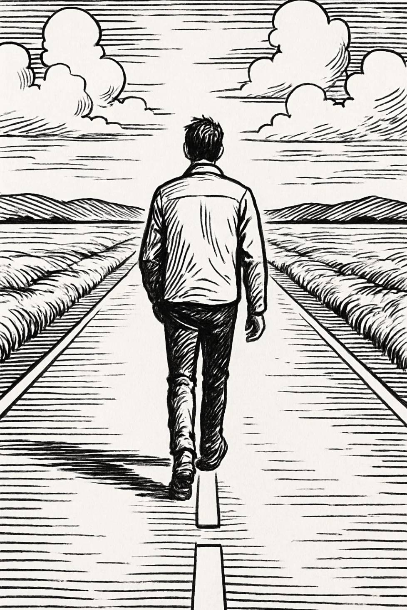
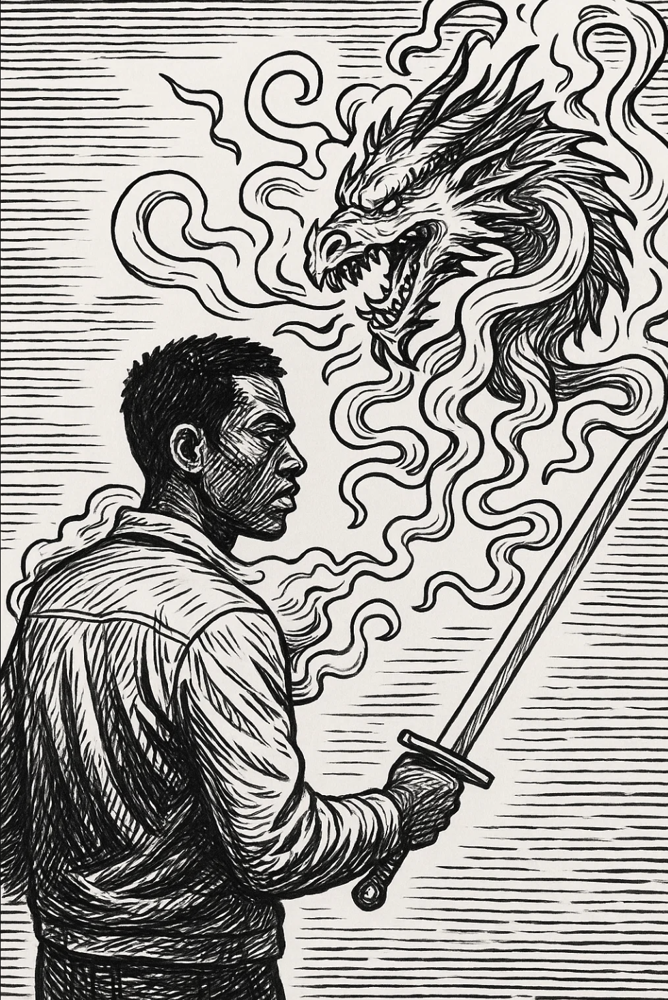

# FACING THE DRAGON
## A Warrior's Path to Healing

**FRANK DYLAN DEL ROSARIO**

---

*To the loved ones who have lost their way in the dark, may they find a way home or a way to find peace and serenity on their path, wherever it may take them.*

---

## COPYRIGHT PAGE

**FACING THE DRAGON: A Warrior's Path to Healing**

Copyright © 2025 by Frank Dylan del Rosario

All rights reserved. No part of this publication may be reproduced, distributed, or transmitted in any form or by any means, including photocopying, recording, or other electronic or mechanical methods, without the prior written permission of the publisher, except in the case of brief quotations embodied in critical reviews and certain other noncommercial uses permitted by copyright law.

**ISBN-13:** 978-1-9584127-0-3  
**ISBN-10:** 1-9584127-0-1

**Library of Congress Control Number:** 2025901234

**Publisher:** Self-Published  
**Publication Date:** 2025  
**First Edition**

**Cover Design:** ... 
**Interior Design:** ....

**Printed in the United States of America**

For permissions requests, please contact the author.

---

## PREFACE

This book exists because young men are drowning, and almost no one is teaching them how to swim.

I wrote this book because I needed it when I was seventeen, and it didn't exist. I needed it when I was twenty-five, and it still didn't exist. I needed it when I was thirty, and the landscape remained barren. Now, in 2025, the need is more urgent than ever, and the resources remain shockingly scarce.

This is not an accident. The scarcity of books specifically designed for young men navigating emotional pain, trauma, and the complex terrain of male mental health is not a market failure or an oversight. It is a reflection of a deeper cultural problem: we have systematically failed to create spaces where men can explore their emotional lives from a distinctly male perspective, without apology, without dilution, and without the well-intentioned but ultimately unhelpful perspectives of those who cannot walk the path we walk.

**Why This Book Matters**

The concepts in this book are not revolutionary. They are ancient wisdom repackaged for a generation of men who have been told that their pain is either non-existent or pathological. This book speaks of dragons, not as external monsters to slay, but as internal forces born from wounds that were never allowed to heal. It speaks of warriors, not as unfeeling machines of destruction, but as men who learned to armor themselves because vulnerability was weaponized against them. It speaks of grandfathers and mentors, not as distant authority figures, but as men who have walked the path and can offer guidance without judgment.

The book matters because it addresses a fundamental truth: men experience emotional pain differently than women. This is not a value judgment. It is not a statement about which experience is more valid or more important. It is simply an acknowledgment of biological, hormonal, and social realities that shape how men process trauma, express emotion, and seek healing.

When a young man is told to "just talk about your feelings" by someone who has never experienced the social consequences of male vulnerability, that advice rings hollow. When he is told to "let it go" by someone who has never had to navigate the complex terrain of male respect and social hierarchy, that advice feels dismissive. When he is told to "be more open" by someone who has never experienced the unique ways in which male emotional expression is policed, mocked, or weaponized, that advice can feel like a trap.

This book matters because it speaks directly to the male experience without translation, without mediation, and without the assumption that what works for others will automatically work for men. It recognizes that the path to healing for a young man is not the same path that works for a young woman, not because one is superior, but because they are fundamentally different journeys.

**Why There Are So Few Books for Young Men**

The publishing industry, like much of the mental health field, has largely failed young men. Walk into any bookstore and you will find shelves overflowing with books about women's emotional health, women's trauma recovery, women's relationship patterns, and women's healing journeys. These books are necessary, valuable, and important. But where are the equivalent resources for men?

The few books that do exist for men often fall into one of two categories: they are either written by women (who, despite their best intentions, cannot fully understand the male experience), or they are written by men who have been so thoroughly trained in therapeutic language that they have lost touch with the raw, unpolished reality of male pain. They speak in sanitized terms that feel foreign to a young man who has learned that his emotions are dangerous, that his vulnerability is weakness, and that his need for connection is a liability.

There are books about "toxic masculinity" that spend more time diagnosing the problem than offering solutions. There are books about "men's issues" that read like academic papers rather than practical guides. There are books that try to make men more like women, as if the solution to male suffering is to erase maleness itself.

What is missing are books that honor the male experience while simultaneously guiding men toward healthier ways of being. Books that recognize that the same traits that can become destructive, strength, protectiveness, competitiveness, stoicism, are also sources of profound value when understood and channeled correctly. Books that don't ask men to become something else, but to become more fully themselves.

**Why This Subject Must Be Completely About Male Needs**

This book is unapologetically focused on the needs of male emotions because male emotions have been systematically ignored, pathologized, or misunderstood for generations. When we try to create "gender-neutral" approaches to emotional healing, we end up with approaches that are actually female-normative, because the default in our culture has become female emotional expression and processing styles.

Male emotions operate differently. This is not a social construct that can be deconstructed away. It is rooted in biology, in hormones, in the ways that testosterone shapes both emotional experience and expression. It is rooted in the unique social pressures that men face: the demand to be providers, protectors, and problem-solvers while simultaneously being emotionally available and vulnerable. It is rooted in the specific ways that male vulnerability is punished, mocked, or exploited in ways that female vulnerability is not.

A book that tries to serve everyone ends up serving no one well. This book makes no apologies for being specifically, exclusively, and unapologetically about the male experience. It does not attempt to be inclusive of all genders because that would dilute its effectiveness. It does not try to be politically palatable because that would compromise its honesty. It speaks directly to men, in language that men understand, about experiences that men have, in ways that honor the unique contours of male emotional life.

**Why Women Cannot and Should Not Have a Say in These Lessons**

This statement will likely make some readers uncomfortable, and that discomfort is precisely why it needs to be said. The idea that women should have input into how men heal from trauma, process emotions, and navigate their mental health is based on a fundamental misunderstanding of what healing requires.

Women cannot walk the path a man walks, not because they are incapable of understanding pain or trauma, but because the path itself is different. Even if a woman were to undergo gender transition, the physiological and genetic nature of being male cannot be fully conceived or imitated. The hormonal landscape of a man, the ways that testosterone shapes emotional experience, stress response, and social behavior, is fundamentally different from the hormonal landscape of a woman. These differences are not superficial. They shape everything from how emotions are experienced to how they are expressed to how they are processed.

But the differences go beyond biology. The social stigma that men are raised under is wholly separate from the social stigma that women experience. Men are taught that their value is tied to their ability to provide, protect, and perform. They are taught that emotional expression is weakness, that vulnerability is dangerous, and that asking for help is failure. These lessons are not the same as the lessons women receive, even when both groups are navigating trauma or emotional pain.

When women attempt to guide men's healing, they often do so from a framework that assumes emotional expression looks the same for everyone. They may encourage men to "just talk about it" without understanding that for many men, talking about emotions feels like a violation of core identity. They may suggest approaches that work beautifully for women but fail to account for the unique ways that men process and integrate emotional experiences.

This is not to say that women cannot be supportive, compassionate, or helpful to men who are healing. They absolutely can be. But support and guidance are different things. Support is about being present, listening, and offering care. Guidance is about understanding the path because you have walked it yourself. Women can offer support. They cannot offer guidance for a journey they have not taken.

The lessons in this book come from men who have walked the path. They come from understanding the unique ways that male trauma manifests, the specific challenges that men face in healing, and the particular tools that work for male emotional processing. These lessons are not transferable to women, and women's lessons are not transferable to men. This is not a statement of superiority or inferiority. It is a statement of difference.

**The Critical Importance of Male-Focused Wisdom and Mental Health**

The mental health crisis among young men is not a minor issue. It is an epidemic. Suicide rates among men are significantly higher than among women. Men are less likely to seek help for mental health issues, and when they do seek help, they are less likely to find resources that speak to their specific needs. Men are overrepresented in addiction, violence, and incarceration, all of which are often symptoms of untreated trauma and emotional pain.

This crisis exists in part because we have failed to create resources that honor the male experience. We have tried to fit men into frameworks designed for women, and when those frameworks don't work, we have blamed men for being resistant, difficult, or unwilling to change. We have pathologized male emotional expression styles instead of understanding them. We have demanded that men become more like women instead of helping them become healthier versions of themselves.

This book represents a different approach. It recognizes that male mental health is not less important than female mental health, but it is equally important. It recognizes that men need resources that are designed specifically for them, that honor their unique experiences, and that speak to them in language they understand. It recognizes that the path to healing for a man is not the same as the path to healing for a woman, and that this difference is not a problem to be solved but a reality to be honored.

The wisdom in this book is not new. It draws from ancient traditions of male mentorship, from the ways that men have historically passed knowledge from one generation to the next. It draws from understanding how male psychology works, how male trauma manifests, and how male healing occurs. It is wisdom that has been largely lost in our modern therapeutic landscape, where one-size-fits-all approaches have become the norm.

**What This Book Offers**

This book offers parables, stories that speak to the heart in ways that direct instruction cannot. It offers patterns, understanding of how childhood wounds become adult behaviors. It offers worksheets, practical tools for transforming the internal dialogue that keeps men trapped in cycles of pain and reaction. It offers a path, not the only path, but a path that has been walked by men who have found their way through the darkness.

Most importantly, this book offers something that has been in desperately short supply: recognition. It recognizes that male pain is real, that male trauma is valid, and that male healing is possible. It recognizes that men are not broken, defective, or inherently problematic. They are wounded, and wounds can heal when given the right tools and the right understanding.

This book is not for everyone. It is specifically for men who are ready to do the hard work of understanding themselves, who are willing to face their dragons, and who are prepared to walk a path that honors their maleness while simultaneously guiding them toward greater health, connection, and peace.

If you are that man, welcome. The path ahead is not easy, but it is yours to walk. This book is here to guide you, not to change who you are, but to help you become who you were meant to be before the world broke something inside you.

The dragon is waiting. It's time to face it.

---

*Frank Dylan del Rosario*  
*2025*

[Table of Contents](000.md)

# TABLE OF CONTENTS

## PART ONE: FOUNDATION

[**WARRIORS FACING DRAGONS**](001.md)

[**CRISIS RESOURCES AND SAFETY PROTOCOLS**](002.md)

[**CHAPTER SEQUENCING GUIDE**](003.md)

---

## PART TWO: THE STORIES (THE DRAGON PARABLES)

[**The Reluctant Student**](004.md)

[**The Grandfather Speaks of Worth**](005.md)

[**The Unheard Boy**](006.md)

[**Respect: The Gateway to the Dragon**](007.md)

[**How Respect Became a Path to Violence**](008.md)

[**The Real Nature of the Dragon**](009.md)

[**The Dragon of Wounded Pride**](010.md)

[**What It Means to Face the Dragon**](011.md)

[**The Fire Inside**](012.md)

[**Why a Young Man Stops Caring About Others**](014.md)

[**The Unseen Wound**](015.md)

[**The Wounded Bear**](016.md)

[**The Chained Giant**](017.md)

[**The Shattered Helmet**](018.md)

[**The Warrior Who Could Not Cry**](019.md)

[**The Lion Who Feared His Roar**](020.md)

[**The Two Wolves by the River**](021.md)

[**The Three Rivers**](022.md)

[**The Empty Quiver**](023.md)

[**The Unfinished Mask**](024.md)

[**The Seven Doors**](025.md)

[**The Test of the Six Mirrors**](026.md)

[**The Warrior Who Walked Backward**](027.md)

[**The Warrior Who Chased Every Shadow**](028.md)

[**The Anvil and the Sword**](029.md)

[**The Blacksmith's Tongs**](030.md)

[**The Silent Stone**](031.md)

[**The Thornling Tree**](032.md)

[**The Haunted Blade**](033.md)

[**The Masterless Horse**](034.md)

[**The Broken Drum**](035.md)

[**The Lamp with No Oil**](036.md)

[**The Echoing Cave**](037.md)

[**The Threads of Fate**](038.md)

[**The Open Hand**](039.md)

[**The Waterfall**](040.md)

[**The Spear with Two Points**](041.md)

[**The Hunter Who Never Missed**](042.md)

[**The Final Bow Before Battle**](043.md)

[**The Warrior Who Learned to Ask for Help**](046.md)

[**The Man Who Forgave His Father**](047.md)

[**The Warrior Who Learned to Receive Love**](048.md)

[**The Man Who Broke the Cycle with His Children**](049.md)

[**The Warrior Who Found Purpose Beyond Survival**](050.md)

[**The Grandfather's Confession**](054.md)

[**The Fire Embers**](055.md)

[**TRANSITIONS**](062.md)

---

## PART THREE: THE PATTERNS (UNDERSTANDING YOUR WOUNDS)

[**THE DISCARDED HEART**](060.md)

[**AFFIRMATION FROM OTHERS**](060.md#2-affirmation-from-others)

[**HEALING THE CYCLE**](060.md#3-healing-the-cycle)

[**HARD TRUTHS OF THE HEART**](060.md#4-hard-truths-of-the-heart)

[**ANGER: THE LANGUAGE OF FEAR**](060.md#5-anger-the-language-of-fear)

[**TRANSFORMING YOUR INTERNAL DIALOGUE**](060.md#6-transforming-your-internal-dialogue)

[**GLOSSARY OF EMOTIONS, COGNITIVE BIASES, DEFENSIVE PATTERNS, AND HEALING CONCEPTS**](060.md#7-glossary-of-emotions-cognitive-biases-defensive-patterns-and-healing-concepts)

[**ADDITIONAL PATTERNS: DEEPER LAYERS OF HEALING**](060.md#8-additional-patterns-deeper-layers-of-healing)

[**A WARRIOR GRANDFATHER'S DRAGON**](061.md)

---

## PART FOUR: THE WORKSHEETS (TRANSFORMING YOUR INTERNAL DIALOGUE)

[**FROM SELF-DESTRUCTION TO SELF-COMPASSION**](063.md)

[**ABANDONMENT AND REJECTION: THE FEAR OF BEING LEFT**](063.md)

[**SELF-WORTH AND IDENTITY: THE BELIEF THAT YOU'RE NOT ENOUGH**](063.md)

[**RELATIONSHIPS AND CONNECTION: THE FEAR OF INTIMACY AND TRUST**](063.md)

[**EMOTIONS AND VULNERABILITY: THE FEAR OF FEELING**](063.md)

[**CONTROL AND PERFECTIONISM: THE ILLUSION OF SAFETY**](063.md)

[**RESPONSIBILITY AND ACCOUNTABILITY: THE BALANCE BETWEEN SELF-BLAME AND DENIAL**](063.md)

[**FORGIVENESS AND LETTING GO: THE WEIGHT OF THE PAST**](063.md)

[**HOPE AND FUTURE: THE FEAR OF BELIEVING THINGS CAN CHANGE**](063.md)

[**INTEGRATION: PRACTICING THE SHIFT FROM UNHEALTHY TO HEALTHY DIALOGUE**](063.md)

[**ADDITIONAL WORKSHEETS: SPECIALIZED TOPICS**](063.md)

[**CONCLUSION: THE FOUNDATION OF HEALING**](063.md)

---

## PART FIVE: THE WORKBOOK (APPENDIX)

[**WRITING YOUR LIFE: A CATHARTIC BIOGRAPHY**](066.md)

[**THE FULL 10-PART BIOGRAPHY OUTLINE**](066.md)

[**PRACTICAL WRITING INSTRUCTIONS**](066.md)

[**ADVANCED SELF-REFLECTION TECHNIQUES**](066.md)

[**TURNING THE BIOGRAPHY INTO A COHERENT BOOK**](066.md)

[**CLOSING: THE PURPOSE OF YOUR BIOGRAPHY**](066.md)

[**GUIDED WRITING WORKSHEETS FOR EACH SECTION**](066.md)

[**PROMPTS FOR TRAUMA EXPLORATION**](066.md)

[**COGNITIVE-BIAS WORKSHEETS**](066.md)

[**FULL TRAUMA-INFORMED WRITING GUIDE**](066.md)

[**CHAPTER-BY-CHAPTER COACHING FOR HIS AUTOBIOGRAPHY**](066.md)

[**"DIALOGUE WITH YOUR YOUNGER SELF" GUIDED JOURNAL**](066.md)

[**PRINTABLE WORKBOOK: TRAUMA GUIDE + AUTOBIOGRAPHY COACHING**](066.md)

---

## APPENDICES

[**QUICK REFERENCE GUIDE**](068.md)

[**PROGRESS TRACKING TOOLS**](065.md)

[**GLOSSARY AND INDEX**](069.md)

[**FINAL CONCLUSION**](070.md)

---

## PART SIX: ADDITIONAL RESOURCES

[**ADDITIONAL PRACTICAL TOOLS**](064.md)

[**GUIDES AND RESOURCES**](067.md)

---

*This table of contents provides a complete map of your healing journey. Use it to navigate between stories, patterns, and practice. Return to it whenever you need to find a specific concept, parable, or exercise.*
